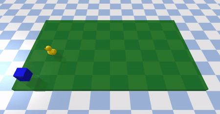

# Grid Target



|   |   |
|---|---|
| Action Space | Discrete(4) |
| Observation Space | MultiDiscrete([3] * n_rows * n_columns) |
| Import | `gymnasium.make("gymtonic/GridTarget-v0")` | 


### Description
This is a basic toy environment to experiment with Pybullet-based scenarios and MultiDiscrete observation spaces. An agent that moves on a grid to reach a target that appears at random positions. The number of columns (along axis X) and rows (along axis Y) of the grid is configurable (default is 5 x 5).

The agent always starts at position (0,0) of the grid.

### Action Space
There are four discrete actions available: go North, Soutch, East and West.

### Observation Space
The state is an n-dimensional vector, where n is `n_rows` x `n_columns`. Each dimension mmay contain one value:
- 0: if the cell is empty
- 1: if the cell is occupied by the agent
- 2: if the cell is occupied by the target

### Rewards
Reward is +1 if the agent reaches the location of the target.

### Starting State
The agent starts always at position (0,0).

### Episode Termination
The episode finishes if:
1) the agent catches the target
2) 100 steps are reached (episode truncated)

### Arguments
The size of the grid can be configured with `n_rows` and `n_columns`. Default is 5 x 5.

For example, to create a 6 x 10 grid:
```python
import gymnasium as gym
import gymtonic

env = gym.make('gymtonic/GridTarget-v0', n_rows=6, n_columns=10, render_mode='human')
```

### Version History
- v0: Initial version

<!-- ### References -->

### Credits
Created by Inaki Vazquez
