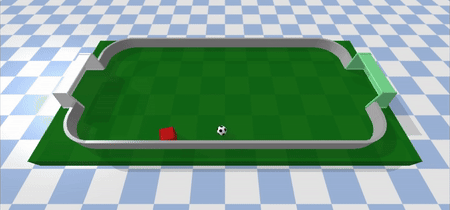

# Soccer Single




|   |   |
|---|---|
| Action Space | `Box(-1, +1, (2,), float32)` |
| Observation Shape | `(8,)` |
| Observation High | `Box([2*math.pi, +10, perimeter_side/2, perimeter_side/2, perimeter_side, perimeter_side, perimeter_side, perimeter_side ])` |
| Observation Low | `Box([-2*math.pi, -10, -perimeter_side/2, -perimeter_side/2, -perimeter_side, -perimeter_side, -perimeter_side, -perimeter_side ] )` |
| Import | `gymnasium.make("gymtonic/SoccerSingle-v0")` | 


### Description
This environment represents a soccer pitch and a player (agent) that must learn to score a goal. The player and the ball appear at random positions on the field. The goal direction can be configured or selected randomly in each episode.

### Action Space
The action space has two continuous dimensions. The first one [-1, 1] represents the rotation to apply to the player (scaled to `math.pi/6`), the second, also in the range [-1, 1], represents the force to move in the forward direction according to the player orientation (negative values move backwards). 

### Observation Space
The state is an 8-dimensional vector representing:
- The current orientation of the player
- The current linear velocity of the player
- Absolute position (x,y) of the player
- Relative position (x,y) of the ball from the player
- Relative position (x,y) of the goal line from the player

### Rewards
Rewards are distributed ass follows:
- +100 for scoring a goal
- +0.01 every time the player kicks the ball
- -0.01 per step (time penalty)

### Starting State
The player and the ball start at random positions in the pitch.

### Episode Termination
The episode finishes if:
1) the player scores a goal
2) the ball goes outside the stadium
3) 500 steps are reached (episode truncated)

### Arguments
The size of the pitch can be configured with `perimeter_side` (length of the pitch, width is half that value). Default is 10.

The maximum speed of the player can be configured with the `max_speed` parameter. Default is 1.

The target goal line can be established with the `goal_target` parameter. Valid values are `right` (right goal line), `left` (left goal line) and `random` (a random goal line for each episode). Default is `right`. When rendering visually the environment, the target goal is displayed in a soft green color for easier identification.

For example,:
```python
import gymnasium as gym
import gymtonic

env = gym.make('gymtonic/SoccerSingle-v0', max_speed=1.5, perimeter_side=8, goal_target='random', render_mode='human')
```


### Version History
- v0: Initial version

<!-- ### References -->

### Credits
Created by Inaki Vazquez
